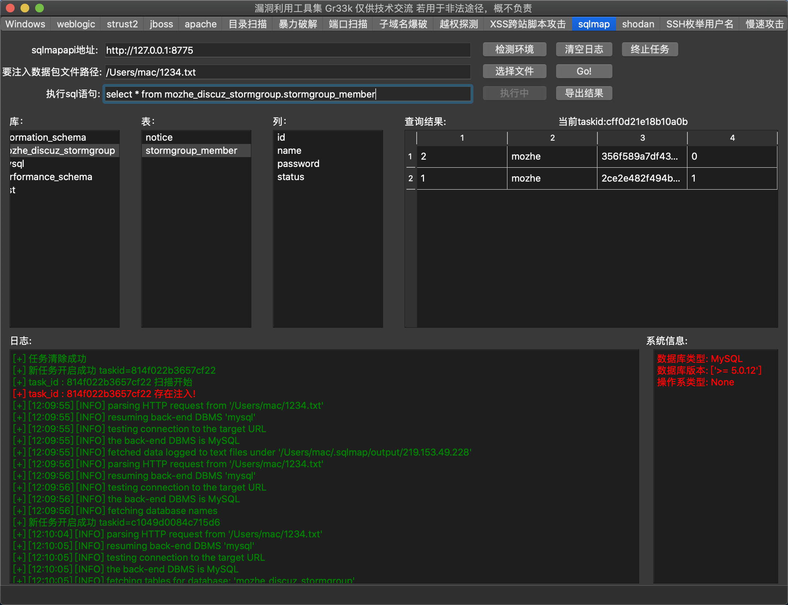

# Gr33k 漏洞利用工具集
一个图形化的漏洞利用集成工具，它用python3书写，参考了大量安全工具的实现原理与思想，在工作之余开发，方便自己的渗透测试工作，我的目的是打造一个红队武器化工具，路还很长，慢慢更新！

**2021-09-15 感谢大家的支持，因9.1日漏洞管理办法生效，本工具已经停止更新，仅在团队内部维护。**

## 提示
本工具提供了大量含有攻击payload的代码，希望大家正确使用该工具，切勿用于非法用途！本人概不负责！
由于时间原因，本工具没有进行全方位的测试，如遇到闪退或者报错bug，请联系jiaxingl@126.com  


## 框架介绍
### 安装
```sh
git clone https://github.com/lijiaxing1997/Gr33k.git
cd Gr33k
pip3 install -r requirements.txt -i https://mirrors.aliyun.com/pypi/simple/
```
如果接下来运行失败，若您是linux操作系统，请手动安装pyqt5以kali为例：  
```
sudo apt-get install python3-pyqt5
```  
若您要使用与ysoserial相关的利用程序,请您手动下载,因为默认该文件夹是空的  
上述安装您将直接获得本工具的源代码，推荐这种安装方式，但因本工具为图形化工具考虑到实用性以及简单性，大家可以自行构建自己的可执行程序，推荐使用Pyinstaller。  
为了方便，我为windows用户打包了一个可执行程序，因为依赖工具比较大，所以我将它放在了百度云盘上.  
下载地址：<https://pan.baidu.com/s/18M5TfcjbemeqQH5zfkbzdA>  
 提取码：c7rr 
 很久没重新打包了，建议自己源码运行吧，网盘的这个bug估计不少。
### 目录结构
- Gr33k.py 是本工具的入口文件。
- dict 该目录存放了本工具自带的一些字典
- tool 该目录存放了常用的渗透测试工具，方便被调用
- plugins 该目录存放了本工具所有的攻击代码库
- weblogic_gui.ui 为PyQt的ui文件

## 使用方法
```sh
python3 Gr33k.py
```

#### 攻击截图如下



